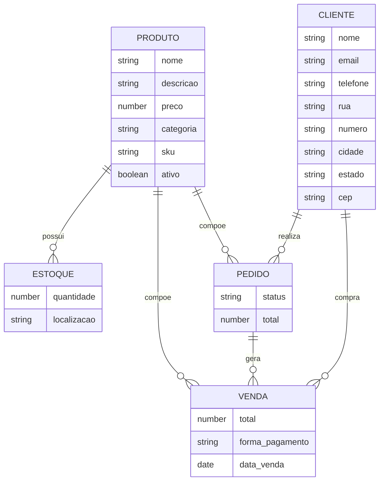

# DNCommerce API

API REST para cadastro de produtos e registro de vendas com MongoDB.

## Como rodar

1. Copie `.env.example` para `.env` e ajuste a `MONGO_URL`.
2. Instale dependencias:
   ```bash
   npm install
   ```
3. Inicie:
   ```bash
   npm start
   ```

## Modelagem (ERD)



## Rotas principais

- `GET /health`
- `POST /produtos`
- `GET /produtos`
- `GET /produtos/:id`
- `PUT /produtos/:id`
- `DELETE /produtos/:id`

- `POST /clientes`
- `GET /clientes`
- `GET /clientes/:id`
- `PUT /clientes/:id`
- `DELETE /clientes/:id`

- `POST /estoque`
- `GET /estoque`
- `PUT /estoque/:id`

- `POST /pedidos`
- `GET /pedidos`
- `GET /pedidos/:id`
- `PATCH /pedidos/:id/status`

- `POST /vendas`
- `GET /vendas`
- `GET /vendas/:id`

## Testes rapidos (PowerShell)

Inicie o servidor com `npm start` e use os comandos abaixo:

```powershell
$produtoBody = @{
  nome = "Hidratante Facial"
  descricao = "Uso diario"
  preco = 59.9
  categoria = "Skincare"
  sku = "SKIN-001"
} | ConvertTo-Json

Invoke-RestMethod http://localhost:3001/produtos -Method Post -ContentType "application/json" -Body $produtoBody
```

```powershell
$clienteBody = @{
  nome = "Maria Souza"
  email = "maria@email.com"
  telefone = "11999999999"
  endereco = @{
    rua = "Rua A"
    numero = "100"
    cidade = "Sao Paulo"
    estado = "SP"
    cep = "01000-000"
  }
} | ConvertTo-Json -Depth 3

Invoke-RestMethod http://localhost:3001/clientes -Method Post -ContentType "application/json" -Body $clienteBody
```

```powershell
$estoqueBody = @{
  produtoId = "<produtoId>"
  quantidade = 10
  localizacao = "Galpao A"
} | ConvertTo-Json

Invoke-RestMethod http://localhost:3001/estoque -Method Post -ContentType "application/json" -Body $estoqueBody
```

```powershell
$pedidoBody = @{
  clienteId = "<clienteId>"
  itens = @(
    @{
      produtoId = "<produtoId>"
      quantidade = 2
    }
  )
} | ConvertTo-Json -Depth 4

Invoke-RestMethod http://localhost:3001/pedidos -Method Post -ContentType "application/json" -Body $pedidoBody
```

```powershell
$vendaBody = @{
  clienteId = "<clienteId>"
  pedidoId = "<pedidoId>"
  forma_pagamento = "cartao"
  itens = @(
    @{
      produtoId = "<produtoId>"
      quantidade = 1
    }
  )
} | ConvertTo-Json -Depth 4

Invoke-RestMethod http://localhost:3001/vendas -Method Post -ContentType "application/json" -Body $vendaBody
```

## Exemplos de payload

### Criar produto

```json
{
  "nome": "Hidratante Facial",
  "descricao": "Uso diario",
  "preco": 59.9,
  "categoria": "Skincare",
  "sku": "SKIN-001"
}
```

### Criar cliente

```json
{
  "nome": "Maria Souza",
  "email": "maria@email.com",
  "telefone": "11999999999",
  "endereco": {
    "rua": "Rua A",
    "numero": "100",
    "cidade": "Sao Paulo",
    "estado": "SP",
    "cep": "01000-000"
  }
}
```

### Criar pedido

```json
{
  "clienteId": "<id-do-cliente>",
  "itens": [
    { "produtoId": "<id-do-produto>", "quantidade": 2 }
  ]
}
```

### Criar venda

```json
{
  "clienteId": "<id-do-cliente>",
  "pedidoId": "<id-do-pedido>",
  "forma_pagamento": "cartao",
  "itens": [
    { "produtoId": "<id-do-produto>", "quantidade": 1 }
  ]
}
```
